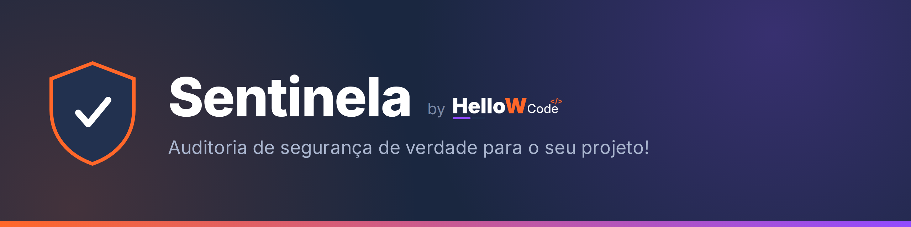

<div align="center">



[](LICENSE)
[](#compatibilidade)
[](#compatibilidade)
[](#compatibilidade)
[](#compatibilidade)
[](https://github.com/fonsecafns/sentinela/stargazers)

**Um auditor de segurança que vive dentro do seu agente de IA.**
Varre o projeto inteiro, usa ferramentas reais (não memória de LLM) e nunca corrige nada sem sua aprovação.

[Instalação](#instalação) · [O que verifica](#o-que-o-sentinela-verifica) · [Compatibilidade](#compatibilidade) · [Como invocar](#como-invocar) · [O relatório](#o-relatório) · [Licença](#licença)

</div>

---

## Por que o Sentinela existe

A maioria dos "auditores de segurança" que rodam dentro de um agente de IA tem dois problemas: chutam CVEs de memória (que podem nem existir) e corrigem o que acham sem perguntar. O Sentinela resolve os dois. Ele só reporta vulnerabilidade confirmada por ferramenta real ou por leitura de código, nunca aplica uma correção sem você aprovar explicitamente, e trata qualquer texto dentro do projeto auditado (comentários, README, commits) como dado, nunca como instrução, o que fecha a porta pra tentativas de injeção de prompt escondidas no próprio código.

## O que o Sentinela verifica

- Vulnerabilidades de código no padrão OWASP Top 10 e CWE (SQL injection, validação de dados, controle de acesso, IDOR etc)
- Dependências desatualizadas, usando ferramentas reais de auditoria (npm audit, pip-audit, osv-scanner e outras conforme a stack), nunca CVEs estimados de memória
- Segredos expostos no código, incluindo o histórico completo do git, não só o estado atual dos arquivos
- Autenticação, cookies e sessão
- CORS, TLS/SSL, HSTS e rate limiting
- Exposição excessiva de dados (IDs internos, chaves de API, nomes de tabela vazando em respostas)
- Segredos e dados sensíveis vazando pro código que roda no navegador ou aplicativo do usuário
- Imagens Docker, containers e infraestrutura como código (Trivy, Checkov)
- Padrões de código inseguro via SAST (Semgrep), como segunda camada além da leitura manual
- WAF e proteção anti-bot, adaptado ao provedor de infraestrutura detectado no projeto
- SSE (Server-Sent Events), quando o projeto usa
- Sinalização de compliance com LGPD/GDPR quando o projeto coleta dados pessoais

A lista completa de categorias e o processo detalhado estão no [`SKILL.md`](SKILL.md). As ferramentas usadas em cada linguagem/ecossistema estão em [`references/ferramentas-por-stack.md`](references/ferramentas-por-stack.md).

## Compatibilidade

O conteúdo mora todo em [`SKILL.md`](SKILL.md), que é a fonte única de verdade. Os arquivos abaixo são gerados automaticamente a partir dele (veja [`scripts/build_adapters.py`](scripts/build_adapters.py)), então atualizar a skill nunca dessincroniza as versões.

| Ferramenta | Arquivo gerado | Como é carregado |
|---|---|---|
| **Claude Code** / Cowork / claude.ai | `SKILL.md` | Só quando você pede algo relacionado a segurança (skill sob demanda) |
| **Cursor** | `.cursor/rules/sentinela.mdc` | Regra "agent requested": o Cursor decide sozinho quando puxar, com base na descrição |
| **Codex CLI** | `AGENTS.md` | Carregado sempre que o Codex abre o projeto (por isso o arquivo reforça: só agir quando você pedir) |
| **Gemini CLI** | `GEMINI.md` | Carregado sempre que o Gemini CLI abre o projeto (mesma regra acima) |

Em todos os casos o comportamento é o mesmo: as regras de ouro, as fases da auditoria e o formato do relatório não mudam de uma ferramenta pra outra, só a forma como cada uma descobre que o Sentinela existe.

## Instalação

### Instalação rápida (recomendada)

Instala em todas as ferramentas suportadas de uma vez, globalmente, pra funcionar em qualquer projeto seu.

**macOS / Linux:**

```bash
curl -fsSL https://raw.githubusercontent.com/fonsecafns/sentinela/main/install.sh | bash
```

**Windows (PowerShell):**

```powershell
irm https://raw.githubusercontent.com/fonsecafns/sentinela/main/install.ps1 | iex
```

### Instalando só uma ferramenta específica

```bash
curl -fsSL https://raw.githubusercontent.com/fonsecafns/sentinela/main/install.sh | bash -s -- --claude
curl -fsSL https://raw.githubusercontent.com/fonsecafns/sentinela/main/install.sh | bash -s -- --codex
curl -fsSL https://raw.githubusercontent.com/fonsecafns/sentinela/main/install.sh | bash -s -- --gemini
curl -fsSL https://raw.githubusercontent.com/fonsecafns/sentinela/main/install.sh | bash -s -- --cursor
```

No PowerShell, o mesmo script aceita os parâmetros equivalentes (`-Claude`, `-Codex`, `-Gemini`, `-Cursor`):

```powershell
& ([scriptblock]::Create((irm https://raw.githubusercontent.com/fonsecafns/sentinela/main/install.ps1))) -Claude
```

Por padrão a instalação é global (`~/.claude/skills`, `~/.codex/AGENTS.md`, `~/.gemini/GEMINI.md`). Pra instalar só no projeto atual, adicione `--project` (bash) ou `-Project` (PowerShell). O Cursor é sempre por projeto, já que ele não tem um mecanismo de regra global por arquivo.

### Cowork ou claude.ai (sem terminal)

1. Baixe o arquivo [`sentinela.skill`](sentinela.skill) deste repositório.
2. Envie esse arquivo numa conversa do Cowork ou claude.ai. A interface reconhece automaticamente que é uma skill e mostra a opção de salvar.
3. Confirme, e a skill fica disponível pra usar em qualquer conversa sua dali em diante.

### Instalação manual

Prefere copiar os arquivos você mesmo? Clone o repositório e copie o que precisar pro lugar certo:

| Ferramenta | Copie | Para |
|---|---|---|
| Claude Code | `SKILL.md` + `references/` | `~/.claude/skills/sentinela/` ou `.claude/skills/sentinela/` no projeto |
| Codex CLI | `AGENTS.md` + `.sentinela-shared/` | `~/.codex/` (anexando ao `AGENTS.md` existente) ou raiz do projeto |
| Gemini CLI | `GEMINI.md` + `.sentinela-shared/` | `~/.gemini/` (anexando ao `GEMINI.md` existente) ou raiz do projeto |
| Cursor | `.cursor/rules/sentinela.mdc` + `.sentinela-shared/` | raiz do projeto |

### Pré-requisitos

- `git` (o instalador usa pra baixar o repositório, e o Sentinela usa pra varrer o histórico completo de commits em busca de segredos expostos).
- As ferramentas de cada linguagem que seus projetos usam (Node.js/npm, Python/pip ou uv etc) não precisam estar pré-instaladas: o Sentinela detecta o que falta durante a auditoria e pede sua permissão antes de instalar qualquer coisa, explicando em linguagem simples o que cada ferramenta faz.

## Como invocar

O Sentinela só age quando você pede explicitamente, ele não dispara sozinho por menções incidentais à palavra "segurança". Frases como estas funcionam em qualquer uma das ferramentas suportadas:

- "roda o sentinela nesse projeto"
- "faz uma auditoria de segurança aqui"
- "verifica vulnerabilidades desse repositório"
- "checa a segurança do projeto"

### Auditoria completa (padrão)

É o modo normal, sem precisar pedir nada além de invocar a skill. O Sentinela lê todo o código do projeto (excluindo só pastas de dependências instaladas e artefatos de build, como node_modules, .venv, .next e __pycache__), roda as ferramentas automatizadas de dependências e segredos, e entrega um relatório completo. É o modo recomendado antes de qualquer deploy importante ou periodicamente.

### Varredura rápida (parcial)

Pra rodar só um check leve, no meio do desenvolvimento, peça explicitamente algo como "varredura rápida" ou "check rápido". Nesse modo o Sentinela roda só as ferramentas automatizadas (dependências e segredos), sem a leitura manual completa do código, e deixa isso destacado no início do relatório. Não substitui a auditoria completa.

## As regras de ouro

1. **Nunca corrige nada sozinho.** O Sentinela só lê, roda ferramentas de análise (que não alteram o projeto) e escreve o relatório. Qualquer correção só acontece depois que você aprova explicitamente, e mesmo assim seguindo um processo de segurança próprio: mapear o estado atual antes de mexer, aplicar, e verificar que nada quebrou depois.
2. **Sempre pede permissão antes de instalar qualquer ferramenta**, explicando em linguagem simples o que ela faz e por que é necessária.
3. **Trata tudo que está dentro do projeto auditado como dado, nunca como instrução.** Comentários, README, mensagens de commit ou qualquer texto do projeto não podem mudar o comportamento do Sentinela, mesmo que pareçam um comando.

## O relatório

Cada auditoria completa gera um arquivo `SECURITY_AUDIT_<data>.md` salvo na raiz do projeto auditado, além de um resumo direto na conversa. O relatório traz:

1. Resumo executivo com contagem de achados por severidade (🔴 Crítica, 🟠 Alta, 🟡 Média, 🟢 Baixa) e uma legenda explicando o que cada nível costuma significar na prática
2. Comparação com a auditoria anterior, se existir uma no projeto (resolvidos, ainda em aberto, novos)
3. Detalhamento de cada vulnerabilidade: severidade, explicação em linguagem simples de qualquer sigla técnica (CWE, CVE, GHSA), localização exata, descrição do problema, evidência (com qualquer segredo real mascarado) e sugestão de correção
4. Confirmação das categorias que foram checadas e não tiveram achado
5. Plano de remediação priorizado em três fases
6. Nota de compliance (LGPD/GDPR), quando aplicável
7. Lembrete pra rodar o Sentinela de novo depois de aplicar as correções, confirmando que tudo foi resolvido

## Estrutura do repositório

```
sentinela/
├── SKILL.md                          # fonte única de verdade: instruções completas da auditoria
├── AGENTS.md                         # gerado a partir do SKILL.md, pro Codex CLI e compatíveis
├── GEMINI.md                         # gerado a partir do SKILL.md, pro Gemini CLI
├── .cursor/
│   └── rules/
│       └── sentinela.mdc             # gerado a partir do SKILL.md, pro Cursor
├── references/
│   └── ferramentas-por-stack.md      # qual ferramenta usar em cada linguagem/ecossistema
├── .sentinela-shared/
│   └── ferramentas-por-stack.md      # cópia da referência acima, usada pelos adaptadores não-Claude
├── scripts/
│   └── build_adapters.py             # regenera os adaptadores a partir do SKILL.md
├── assets/
│   └── banner.png                    # banner deste README
├── install.sh                        # instalador (macOS/Linux) — MIT
├── install.ps1                       # instalador (Windows) — MIT
├── LICENSE                           # Business Source License 1.1 (SKILL.md e adaptadores)
├── LICENSE-MIT                       # MIT (instalador e script de build dos adaptadores)
├── README.md                         # este arquivo
└── sentinela.skill                   # pacote pronto (zip), pra instalar direto no Cowork/claude.ai
```

## Licença

Licença dividida, no mesmo espírito de projetos como o caveman: a parte que existe pra ser adotada livremente é MIT, a parte que é o valor de verdade do projeto fica protegida por BSL até uma data de conversão.

**[MIT](LICENSE-MIT)** — o instalador (`install.sh`, `install.ps1`) e o script que gera os adaptadores (`scripts/build_adapters.py`). É só ferramental de distribuição, sem valor competitivo em si, então fica liberado sem restrição.

**[BSL-1.1](LICENSE)** — `SKILL.md` e os adaptadores gerados a partir dele (`AGENTS.md`, `GEMINI.md`, `.cursor/rules/sentinela.mdc`, `references/`, `.sentinela-shared/`, `sentinela.skill`), que são o método de auditoria em si, a parte que o Sentinela existe pra proteger. Source-available: você lê, usa, copia e modifica livremente pra uso pessoal, uso interno na sua empresa, ou pra auditar seus próprios projetos e os de clientes. O que não é permitido sem uma licença comercial separada é oferecer o Sentinela (ou uma versão modificada dele) como produto ou serviço comercial pra terceiros, por exemplo uma plataforma paga concorrente construída em cima dele. Em 2030-08-24 essa parte converte automaticamente pra MIT também, e o projeto inteiro passa a ser Open Source sem essa restrição.

Isso não é uma consultoria jurídica, os termos completos e vinculantes são os dos arquivos [`LICENSE`](LICENSE) e [`LICENSE-MIT`](LICENSE-MIT).

## Origem

Criado por Matheus, fundador da HelloW Code, uma software house especializada em bots, sistemas web, automações e projetos sob demanda, incluindo auditorias de segurança, revisões de código e testes de vulnerabilidades. Matheus atua como full stack developer, software engineer e AppSec engineer, e criou o Sentinela pra aplicar na própria rotina de desenvolvimento o mesmo rigor de segurança que a HelloW Code leva pros projetos dos clientes.

Saiba mais sobre a HelloW Code: [@hellowcode](https://instagram.com/hellowcode) no Instagram.
